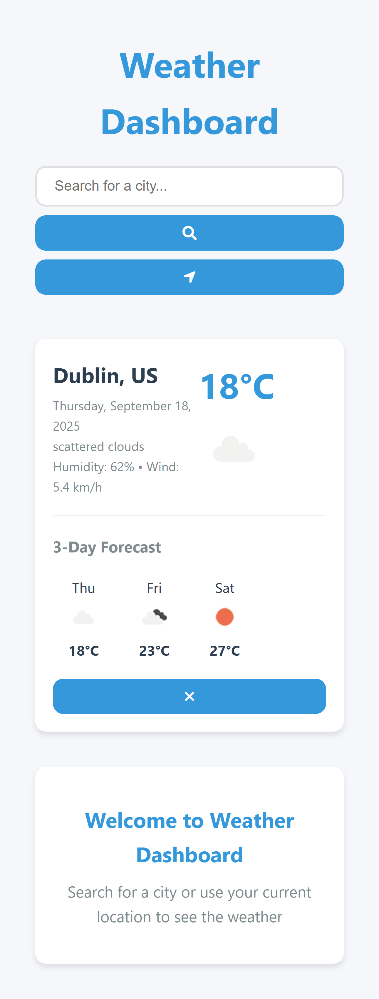

# Weather Dashboard

A clean, responsive weather dashboard that displays real-time weather information for any city worldwide. Built with vanilla JavaScript, HTML5, and CSS3.



## Features

- **Real-time Weather Data**: Get current weather conditions and 3-day forecast
- **Search Any City**: Look up weather for any city worldwide
- **Current Location**: Automatically detect and display weather for your current location
- **Responsive Design**: Works on desktop, tablet, and mobile devices
- **Clean UI**: Minimalist and user-friendly interface
- **Loading States**: Visual feedback during data fetching
- **Error Handling**: User-friendly error messages

## Technologies Used

- HTML5
- CSS3 (with CSS Variables for theming)
- JavaScript (ES6+)
- [OpenWeatherMap API](https://openweathermap.org/api)
- Font Awesome Icons

## Getting Started

### Prerequisites

- A modern web browser (Chrome, Firefox, Safari, Edge)
- An internet connection

### Installation

1. Clone the repository:
   ```bash
   git clone https://github.com/your-username/weather-dashboard.git
   ```

2. Navigate to the project directory:
   ```bash
   cd weather-dashboard
   ```

3. Open `index.html` in your preferred web browser.

## Usage

1. **Search for a City**:
   - Type a city name in the search bar
   - Press Enter or click the search icon

2. **Use Your Current Location**:
   - Click the location icon to get weather for your current location (requires location permission)

3. **Remove a City Card**:
   - Click the '×' button on any weather card to remove it

## API Key

This project uses the OpenWeatherMap API. The included API key is for demonstration purposes. For production use, consider:

1. Getting your own API key from [OpenWeatherMap](https://openweathermap.org/api)
2. Replacing the `API_KEY` constant in `app.js` with your own key

## Project Structure

```
weather-dashboard/
├── index.html          # Main HTML file
├── styles.css          # Stylesheet
├── app.js              # Main JavaScript file
├── favicon.svg         # Website favicon
└── README.md           # This file
```

## Browser Support

- Chrome (latest)
- Firefox (latest)
- Safari (latest)
- Edge (latest)
- Mobile browsers (iOS/Android)

## License

This project is open source and available under the [MIT License](LICENSE).

## Acknowledgments

- Weather data provided by [OpenWeatherMap](https://openweathermap.org/)
- Icons by [Font Awesome](https://fontawesome.com/)
- Google Fonts for typography
